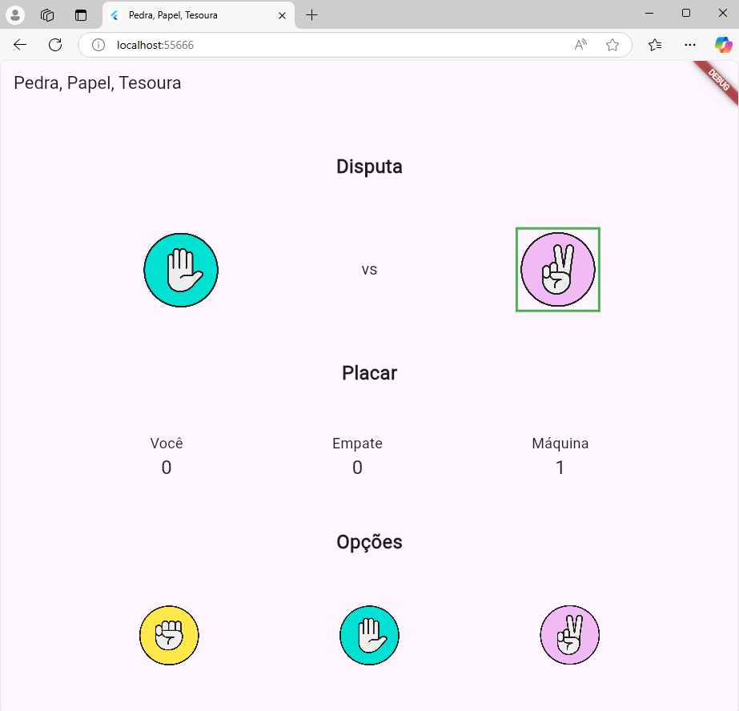
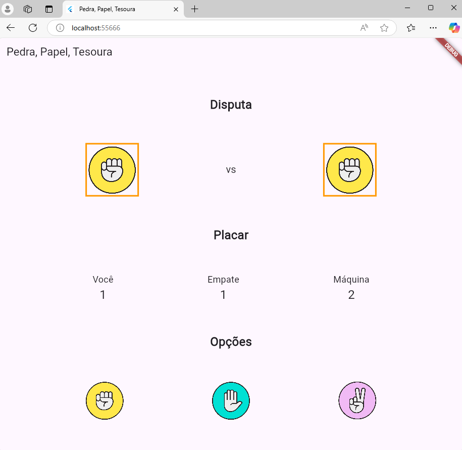
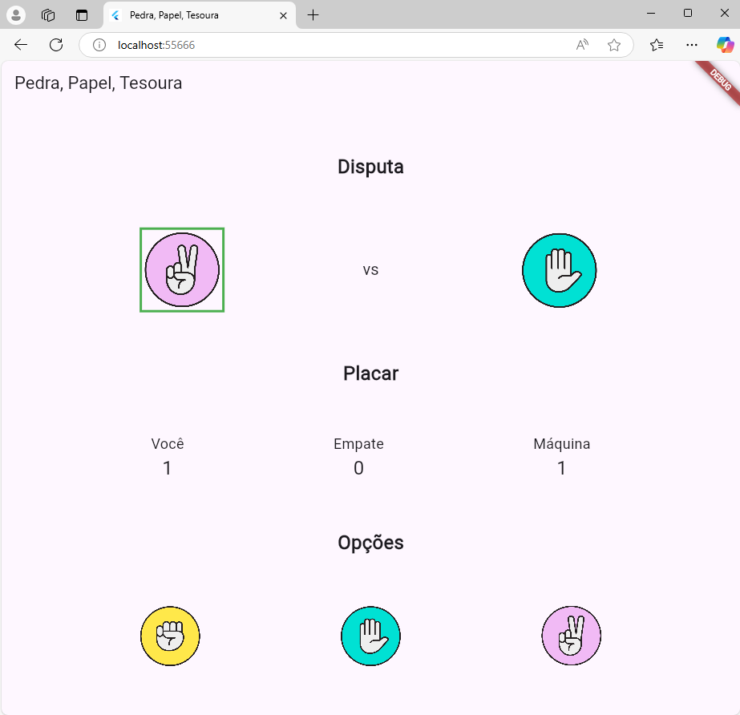

# Pedra, Papel, Tesoura

## Descrição do Aplicativo

**Nome**: Pedra, Papel, Tesoura  
**Objetivo**: Este aplicativo é um jogo clássico de "Pedra, Papel, Tesoura" (também conhecido como Jokenpô), onde o usuário compete contra o aplicativo. O objetivo é permitir que o usuário escolha entre pedra, papel ou tesoura, enquanto o aplicativo faz uma escolha aleatória. O vencedor de cada rodada é determinado pelas regras tradicionais do jogo (pedra ganha de tesoura, tesoura ganha de papel, papel ganha de pedra), e o placar é atualizado com os pontos do usuário, do aplicativo e os empates. O aplicativo exibe as escolhas de ambos os lados, destaca o vencedor de cada rodada com uma borda colorida (verde para o vencedor, laranja para empate) e mantém um placar atualizado.

## Matrícula dos Componentes da Dupla

- **Aluno1**: 222100006
- **Aluno2**: 123100058

## Captura de Tela do Aplicativo

Abaixo está uma captura de tela do aplicativo em funcionamento:

